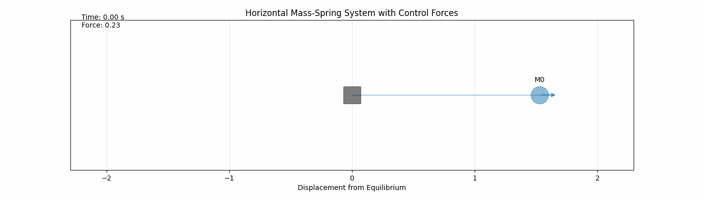
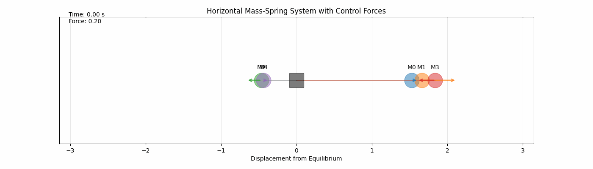
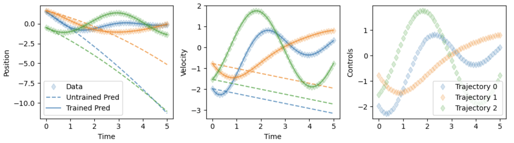

# 2024 Neural ODE Forced Harmonic Oscillator
This repo provides an example of how to construct a Neural Controlled Ordinary Differential Equation (NCODE) model for a simple 1D forced harmonic oscillator. 

The neural ODE is batch trained over all trajectories simultaneously. 

The acceleration of a mass of mass $m$, with spring constant $k$, damping coefficient $c$, and forcing force $u$ is given by 
$$
F_\mathrm{net} = m a \quad \rightarrow \quad \frac{d^2x}{dt^2} = \frac{-k \ x - c v  + u}{m} 
$$
Maintaining the convention in the introduction above, the state vector $y$ contains both positions $x$ and velocity $v$ and the forcing function $u$ are the input controls. We then do the standard procedure of reducing the second order differential equation into two first order differential equations as 
$$
\frac{dx}{dt} = v \quad \quad \mathrm{and} \quad \quad \frac{dv}{dt} = \frac{-k \ x - c v  + u}{m} 
$$

Below is an aniamtion of one mass with certain initial conditions ($x_0$, $y_0$) and physical parameters ($m, \ k, \ c$) undergoing its $t_f=5$ second trajectory.

With additional code, we can use this defined physical system to generate a batch of trajectories with different initial conditions ($x_0, y_0$) and different physics parameters ($m, \ k, \ c$). 

This will be the "truth" data from which our neural model attempts to learn dynamics from. We will train on the entire batch of trajectories, leveraging's PyTorch's torchdiffeq package to easily integrate a batch of initial conditions forward in time. 

 Note the first index of a tensor in PyTorch describes the batch dimension. Our truth data is then of shape `y_truth.shape = [batch size, number of timesteps, state dim]`. In this exmaple, I generate 50 trajectories, each with randomized initial conditions and randomized control inputs to train on. Below are the first 5 trajectories. 

Below is a gif of the training for the 3 trajectories above, for the first 1000 epochs. Again, during training all initial conditions are simulationeously evolved forward per timestep using their respective controls. The loss is evaluated over all trajectories over both position and velocity states over all time. 

It is apparent that the neural network $\mathrm{NN}(y,u,t)$, when given controls $u(t)$, appears to have learned the dynamics of the model enough to fit the training data. A more careful treatment is required to evaluate performance outside of the training data, but is well-beyond the scope of this example. 

Here is a final image comparison of the pre-training predictions and the post-training predictions for the first three trajectories. 

